# HireNowPro MVP - System Flowchart

## Complete Application & Interview Process Flow

```
┌─────────────────────────────────────────────────────────────────┐
│                    HIRENOWPRO INTERVIEW FLOW                    │
└─────────────────────────────────────────────────────────────────┘

1. REGISTRATION & INTERVIEW SETUP
   ┌──────────────────────┐
   │ Applicant Registers  │
   │  POST /api/applicants│
   └──────────┬───────────┘
              ↓
   ┌──────────────────────┐
   │ Status: 'pending'    │
   └──────────┬───────────┘
              ↓
   ┌──────────────────────┐
   │ Create Interview     │
   │ POST /api/interviews │
   └──────────┬───────────┘
              ↓
   ┌──────────────────────┐
   │ Status: 'scheduled'  │
   │ GET Questions        │
   └──────────┬───────────┘

2. VIDEO RECORDING (Loop for each question)
              ↓
   ┌──────────────────────┐
   │ Display Question     │
   └──────────┬───────────┘
              ↓
   ┌──────────────────────┐
   │ Record Video         │
   └──────────┬───────────┘
              ↓
   ┌──────────────────────┐
   │ Upload Video         │
   │ POST video-response  │
   └──────────┬───────────┘
              ↓
        [More Questions?]
         Yes ↑  │ No
             └──┘

3. SUBMISSION & PROCESSING
              ↓
   ┌──────────────────────┐
   │ Submit Interview     │
   │ POST /submit         │
   └──────────┬───────────┘
              ↓
   ┌──────────────────────┐
   │ Validation Check     │
   └──────────┬───────────┘
              ↓
   ┌──────────────────────┐
   │ Queue Processing     │
   │ Status: 'queued'     │
   └──────────┬───────────┘
              ↓
   ┌──────────────────────┐
   │ Celery Task Starts   │
   │ (Background)         │
   └──────────┬───────────┘

4. AI ANALYSIS
              ↓
   ┌──────────────────────┐
   │ 1. Transcribe Audio  │
   │ 2. Sentiment         │
   │ 3. Content Analysis  │
   │ 4. Body Language     │
   │ 5. Calculate Scores  │
   └──────────┬───────────┘
              ↓
   ┌──────────────────────┐
   │ Save AI Results      │
   │ Status: 'completed'  │
   └──────────┬───────────┘

5. FINAL RESULTS
              ↓
   ┌──────────────────────┐
   │ Calculate Final Score│
   │ (Average of all)     │
   └──────────┬───────────┘
              ↓
        [Score >= 70%?]
         ┌──┴──┐
         │     │
      YES│     │NO
         ↓     ↓
   ┌─────────┐ ┌─────────┐
   │ PASSED  │ │ FAILED  │
   │ ✓       │ │ ✗       │
   └────┬────┘ └────┬────┘
        │           │
        ↓           ↓
   Status:      Status:
   'passed'     'failed'
        │           │
        ↓           ↓
   Clear        Set reapply
   reapply      date: +1 month
   date             │
        │           │
        ↓           ↓
   Send         Send
   notification notification
        │           │
        ↓           ↓
   HR Portal    HR Portal
   Display      Display
        │           │
        ↓           ↓
   ┌─────────┐ ┌─────────┐
   │ ✓ DONE  │ │ Can     │
   │         │ │ Reapply │
   │         │ │ in 1    │
   │         │ │ month   │
   └─────────┘ └────┬────┘
                    │
                    └──> Back to Start

KEY POINTS:
- Registration → Interview Setup → Answer 5 Questions
- Upload Videos → Submit → AI Processing (Background)
- Pass (≥70%) → Status: 'passed' → No waiting period
- Fail (<70%) → Status: 'failed' → Wait 1 month to reapply
```

---

## Detailed Process Breakdown

### Phase 1: Applicant Registration

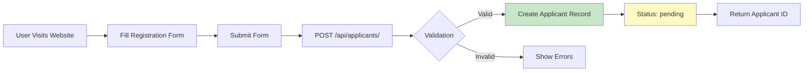

**API Endpoint:** `POST /api/applicants/`

- **Input:** first_name, last_name, email, phone, application_source
- **Output:** Applicant object with ID and status
- **Status:** `pending`

---

### Phase 2: Interview Creation & Questions

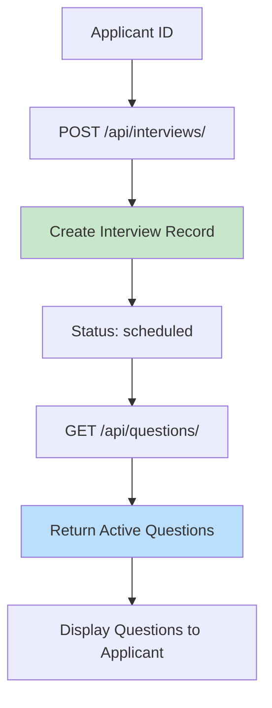

**API Endpoints:**

1. `POST /api/interviews/` - Create interview session

   - **Input:** applicant_id, interview_type
   - **Output:** Interview object with ID

2. `GET /api/questions/` - Get all active questions
   - **Output:** List of questions (ordered by order field)

---

### Phase 3: Video Recording & Upload

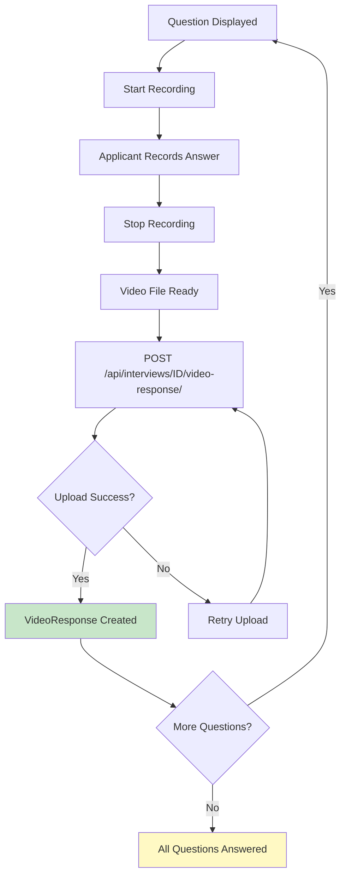

**API Endpoint:** `POST /api/interviews/{id}/video-response/`

- **Input:** question_id, video_file, duration
- **Output:** VideoResponse object
- **Process:** Repeat for each question

---

### Phase 4: Interview Submission & Processing

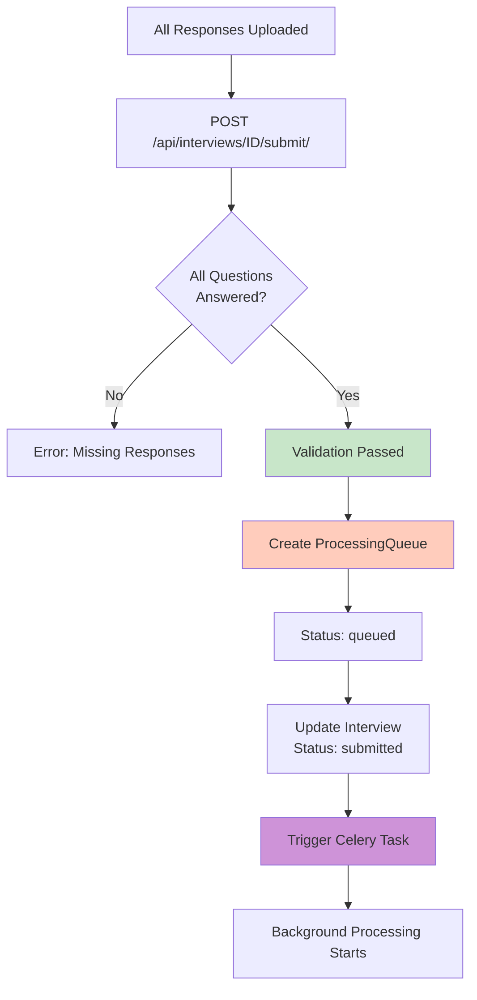

**API Endpoint:** `POST /api/interviews/{id}/submit/`

- **Validation:** Ensures all questions have video responses
- **Actions:**
  1. Create ProcessingQueue record
  2. Update interview status to 'submitted'
  3. Trigger async Celery task

---

### Phase 5: AI Analysis Processing (Background)

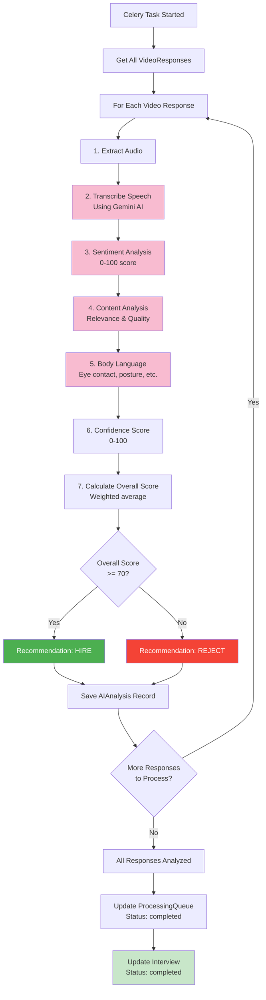

**AI Analysis Components:**

1. **Transcription:** Convert speech to text using Gemini AI
2. **Sentiment Score:** Analyze emotional tone (0-100)
3. **Confidence Score:** Measure speaking confidence (0-100)
4. **Body Language:** JSON analysis of visual cues
5. **Overall Score:** Weighted average of all metrics
6. **Recommendation:** HIRE (≥70%) or REJECT (<70%)

---

### Phase 6: Results & Status Updates

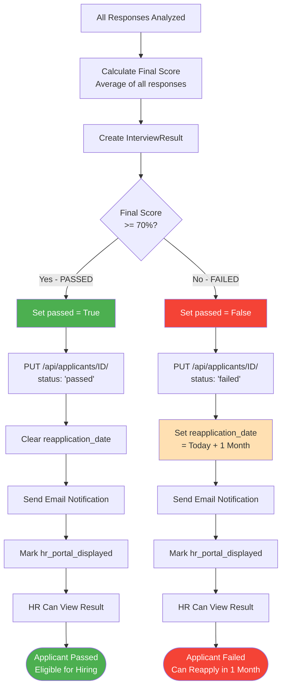

**Automatic Status Updates:**

- **PASSED:**

  - Applicant status → `'passed'`
  - `reapplication_date` → `null` (cleared)
  - Email notification sent
  - Displayed in HR portal

- **FAILED:**
  - Applicant status → `'failed'`
  - `reapplication_date` → Today + 1 month (e.g., Dec 10, 2025)
  - Email notification sent
  - Displayed in HR portal
  - Applicant can reapply after reapplication_date

---

## API Endpoints Summary

### 1. Applicant Registration

```
POST /api/applicants/
GET  /api/applicants/
GET  /api/applicants/{id}/
PUT  /api/applicants/{id}/
PATCH /api/applicants/{id}/
```

### 2. Interview Management

```
POST /api/interviews/
GET  /api/interviews/
GET  /api/interviews/{id}/
POST /api/interviews/{id}/video-response/
GET  /api/interviews/{id}/analysis/
POST /api/interviews/{id}/submit/
```

### 3. Interview Questions

```
GET /api/questions/
GET /api/questions/{id}/
```

---

## Data Models Relationships

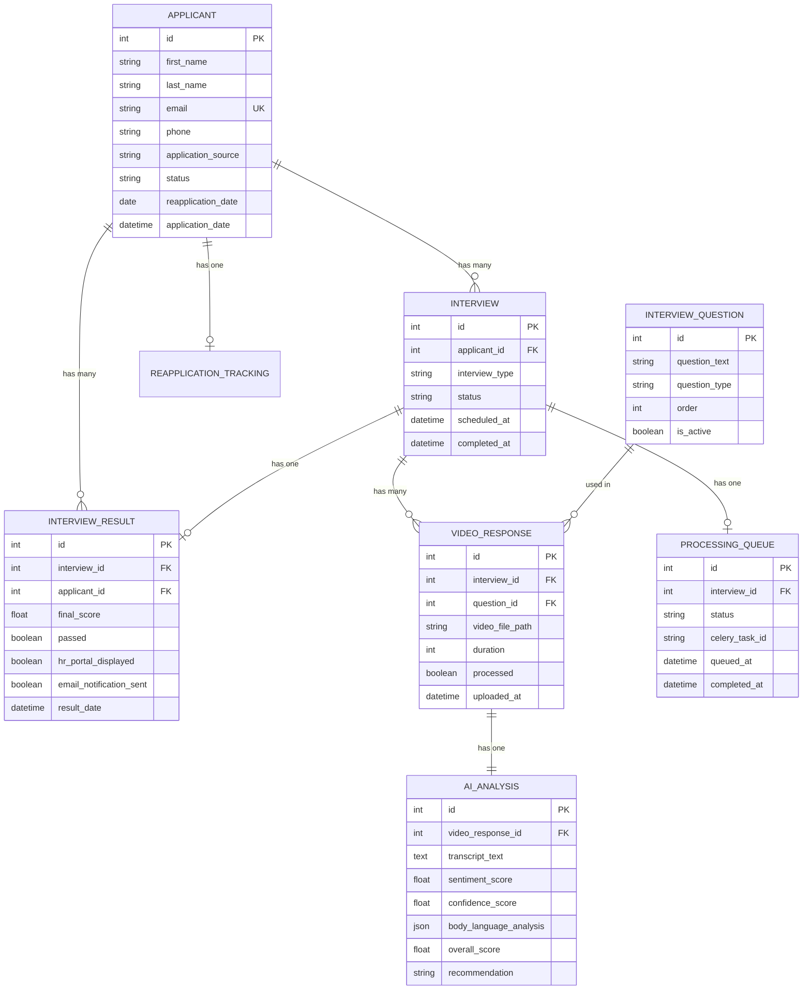

---

## Status Transitions

### Applicant Status Flow

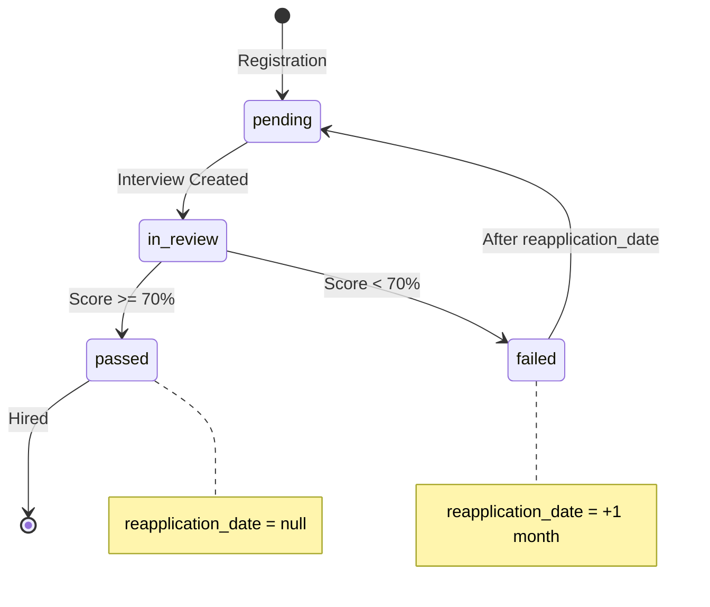

### Interview Status Flow

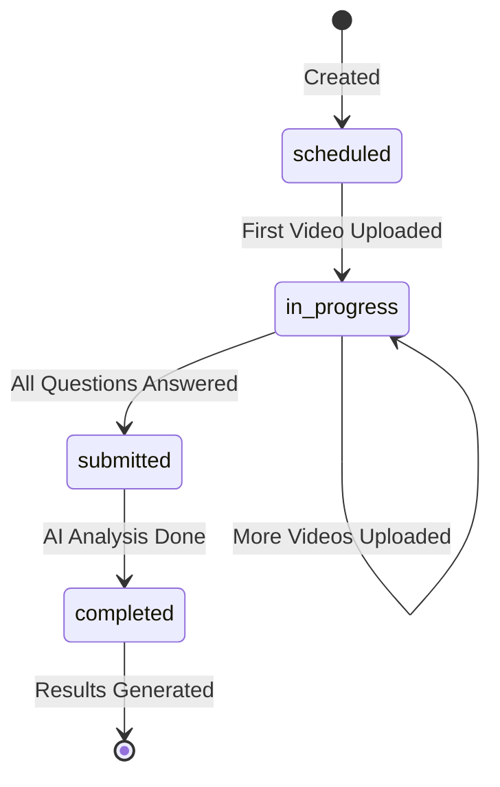

### Processing Queue Status Flow

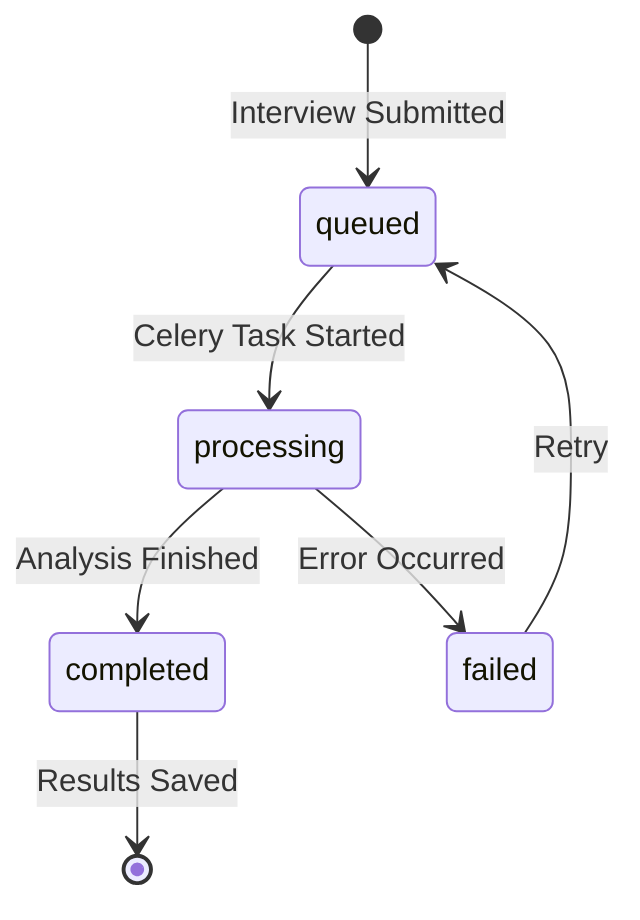

---

## Timeline Example (Single Applicant)

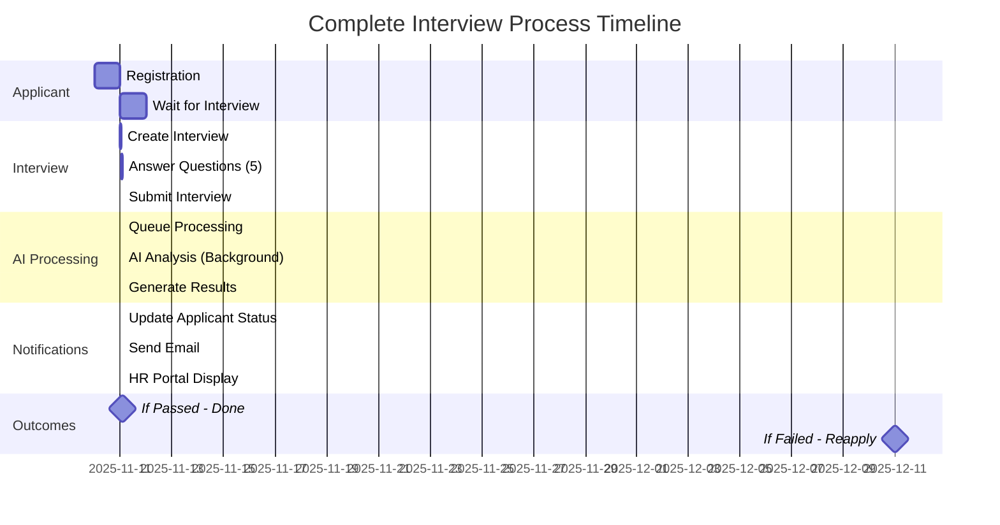

**Total Time:**

- **Applicant Actions:** ~35-40 minutes (registration + answering questions)
- **System Processing:** ~10 minutes (AI analysis + results)
- **Reapplication Wait:** 1 month (if failed)

---

## Key Features Summary

### ✅ Implemented in MVP

1. **Applicant Registration** - Public API, no authentication required
2. **Interview Creation** - Links applicant to interview session
3. **Question Management** - Admin creates questions, API serves them
4. **Video Upload** - Accept video files for each question
5. **Analysis Retrieval** - Get AI analysis results
6. **Submission Validation** - Ensure all questions answered
7. **Automatic Status Updates** - Pass/Fail based on 70% threshold
8. **Reapplication Logic** - Auto-set date to +1 month if failed

### 🔄 To Be Implemented (Future Phases)

1. **AI Processing** - LangChain + Gemini integration
2. **Celery Tasks** - Async background processing
3. **Email Notifications** - Automated emails to applicants
4. **HR Portal** - Web interface for recruiters
5. **Authentication** - JWT tokens for protected endpoints
6. **Document Upload** - Resume/CV handling
7. **Advanced Analytics** - Detailed reporting dashboard

---

## Testing Checklist

- [ ] **Applicant Registration**

  - [ ] POST /api/applicants/ creates new applicant
  - [ ] Returns applicant ID and status='pending'
  - [ ] Email uniqueness validated

- [ ] **Interview Creation**

  - [ ] POST /api/interviews/ with valid applicant_id
  - [ ] Returns interview ID and status='scheduled'
  - [ ] GET /api/questions/ returns active questions

- [ ] **Video Upload**

  - [ ] POST video for each question
  - [ ] Verify VideoResponse records created
  - [ ] Check video files saved to media folder

- [ ] **Interview Submission**

  - [ ] POST submit fails if missing responses
  - [ ] POST submit succeeds when all answered
  - [ ] ProcessingQueue created with status='queued'
  - [ ] Interview status updated to 'submitted'

- [ ] **Status Updates**

  - [ ] PATCH applicant status to 'failed'
  - [ ] Verify reapplication_date set to +1 month
  - [ ] PATCH applicant status to 'passed'
  - [ ] Verify reapplication_date cleared

- [ ] **Analysis Retrieval**
  - [ ] GET /api/interviews/{id}/analysis/
  - [ ] Returns aggregated scores
  - [ ] Shows recommendation (HIRE/REJECT)

---

## Production Deployment Considerations

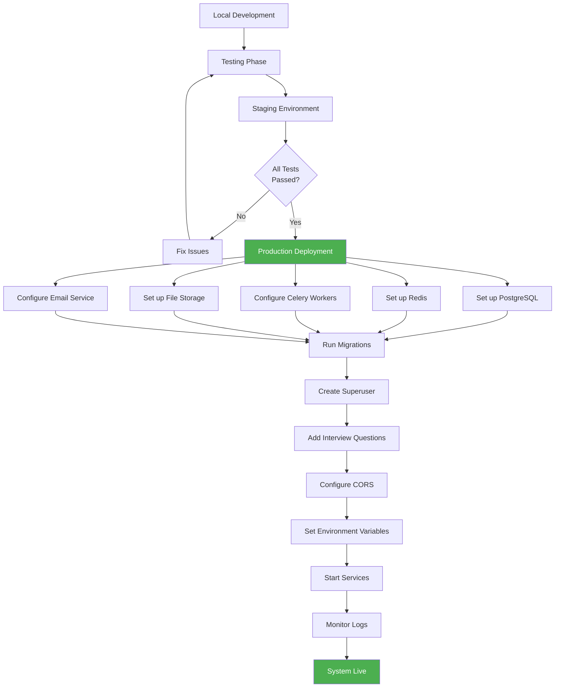

---

## Quick Reference

| Component              | Endpoint                               | Method | Purpose                    |
| ---------------------- | -------------------------------------- | ------ | -------------------------- |
| Applicant Registration | `/api/applicants/`                     | POST   | Register new applicant     |
| Interview Creation     | `/api/interviews/`                     | POST   | Start interview session    |
| Get Questions          | `/api/questions/`                      | GET    | Fetch all active questions |
| Upload Video           | `/api/interviews/{id}/video-response/` | POST   | Submit video answer        |
| Submit Interview       | `/api/interviews/{id}/submit/`         | POST   | Complete interview         |
| Get Analysis           | `/api/interviews/{id}/analysis/`       | GET    | Retrieve AI results        |
| Update Status          | `/api/applicants/{id}/`                | PATCH  | Change applicant status    |

**Status Values:**

- Applicant: `pending`, `in_review`, `passed`, `failed`
- Interview: `scheduled`, `in_progress`, `submitted`, `completed`
- Processing: `queued`, `processing`, `completed`, `failed`

**Scoring Threshold:** 70% = Pass/Fail cutoff

**Reapplication:** Automatically set to +1 month from failure date

---

_Generated: November 10, 2025_
_HireNowPro MVP - Phase 1_
